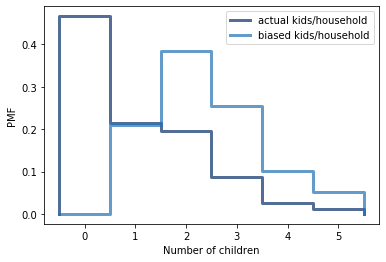

[Think Stats Chapter 3 Exercise 1](http://greenteapress.com/thinkstats2/html/thinkstats2004.html#toc31) (actual vs. biased)

**Question:**
---
Something  like  the  class  size  paradox  appears  if  you  survey children and ask how many children are in their family.  Families with many children are more likely to appear in your sample, and families with no children have no chance to be in the sample. Use the NSFG respondent variable NUMKDHH to construct the actual distribution for the number of children under 18 in the household. Now compute the biased distribution we would see if we surveyed the children and asked them how many children under 18 (including themselves) are in their household. Plot the  actual  and  biased  distributions,  and  compute  their  means.   As a starting place, you can use chap03ex.ipynb.


**Code:**
---
```{python}
import numpy as np
import nsfg
import first
import thinkplot
import thinkstats2
import random
import scipy.stats

resp = nsfg.ReadFemResp()
pmf = thinkstats2.Pmf(resp.numkdhh, label='actual kids/household')
biased_pmf=pmf.Copy(label='biased kids/household')

for x,prob in pmf.Items():
    biased_pmf[x] *= x
biased_pmf.Normalize()

thinkplot.Pmfs([pmf,biased_pmf])
thinkplot.Config(xlabel='Number of children', ylabel='PMF')

actual_mean=0
biased_mean=0

for x,prob in pmf.Items():
    actual_mean += x*prob
    biased_mean += x*biased_pmf[x]
    
print('actual mean:',actual_mean)
print('biased mean:',biased_mean)
```


**Output:**
---


actual mean: 1.024205155043831

biased mean: 2.403679100664282
