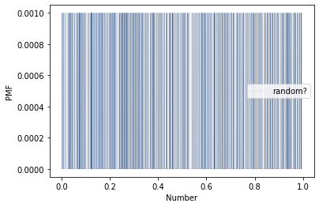

[Think Stats Chapter 4 Exercise 2](http://greenteapress.com/thinkstats2/html/thinkstats2005.html#toc41) (a random distribution)

**Question:**
---
The numbers generated by random.random are supposed to be uniform between 0 and 1; that is, every value in the range should have the same probability. Generate 1000 numbers from random.random and plot their PMF and CDF. Is the distribution uniform?


**Code:**
---
```{python}
import numpy as np
import nsfg
import first
import thinkplot
import thinkstats2
import random
import scipy.stats

random_list = np.random.random(1000)
random_pmf = thinkstats2.Pmf(random_list,label = 'random?')
random_cdf = thinkstats2.Cdf(random_list,label = 'random?')
thinkplot.Pmf(random_pmf,linewidth=.1)
thinkplot.Config(xlabel='Number', ylabel='PMF')
thinkplot.Cdf(random_cdf)
thinkplot.Config(xlabel='Number', ylabel='CDF')
```


**Output:**
---




**Explanation:**
---
Based on the plots, the distribution appears to be uniform.